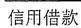
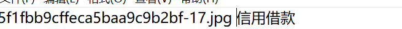

识别
=
背景
--
这是2021年服务外包A18题债券图表数据检测的第二个子任务，识别文字

安装
--
数据集
* 训练集和测试集需要自己去找，数据图片如图：
  * 图片位置放在根目录的out文件夹中
  * 索引文件为train.txt和test.txt,位置在根目录下。索引格式如图：  
 

* 预测集在images.zip中。

依赖包
* 所有需要的依赖包都在requirements.txt文件中

使用
--
模型训练
* 运行train.py文件，生成的模型文件会保存在根目录下的model文件中

模型预测
* 运行reference.py文件，生成的结果集会在根目录下的image_info_A_1000.txt文件中。注意：data.txt是真实的结果集，还可以运行py文件来检测预测的结果集的正确度。

